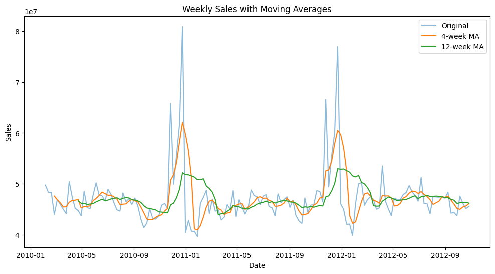
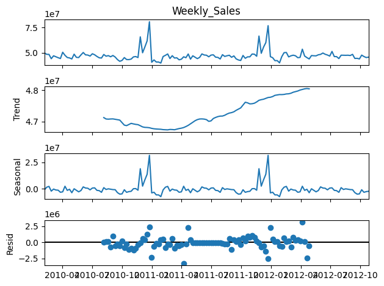
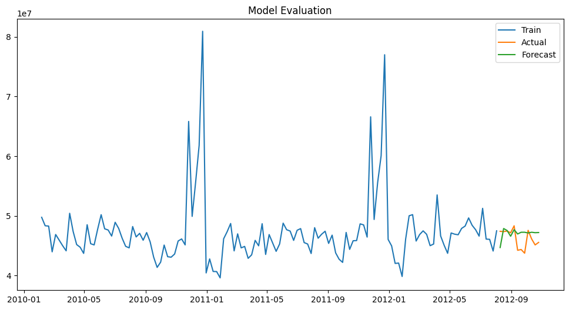

  <h1>🏬 Walmart Sales Forecasting – Time Series Analysis</h1>

  
  
  
  
  
  

## 📌 Project Overview

This project analyzes Walmart store sales data to uncover patterns, trends, and seasonal behaviors, and to forecast future weekly sales using time series techniques. 
The analysis is based on the **Walmart Recruiting Store Sales Forecasting dataset**, a real-world dataset used in a Kaggle competition.

---

## Objectives
- Analyze historical sales data
- Identify trends and seasonal patterns
- Test for stationarity
- Build forecasting models
- Evaluate model performance
- Generate business insights

---

## 🛠️ Tools & Technologies
| Tool | Purpose |
|------|---------|
| Python | Core programming language |
| Pandas | Data loading, cleaning & manipulation |
| Matplotlib | Data visualisation & plotting |
| Statsmodels | Time series modelling (ARIMA, ADF Test) |
| Scikit-learn | Model evaluation (MAE) |

---

## 📂 Dataset
- **Source:** [Walmart Recruiting Store Sales Forecasting – Kaggle](https://www.kaggle.com/c/walmart-recruiting-store-sales-forecasting)
- **Key files used:**
  - `train.csv` – historical weekly sales data
  - `features.csv` – additional economic factors (fuel price, CPI, unemployment)
  - `stores.csv` – store type and size information

---

### Key Variables

| Variable | Description |
|----------|-------------|
| `Date` | Time index (weekly) |
| `Weekly_Sales` | Target variable |
| `Store` | Store identifier |
| `Dept` | Department identifier |

---

## 🔍 Project Workflow

### 1. Data Loading & Cleaning
- Loaded and merged `train.csv`, `features.csv`, and `stores.csv`
- Converted `Date` to datetime format
- Sorted data chronologically
- Aggregated total weekly sales by date

---

### 2.  🕐 Time Index Setup
- Set `Date` as time index
- Created time series structure for analysis

---

### 3. Stationarity Check (ADF Test)
- Applied **Augmented Dickey-Fuller (ADF)** test
- **Result:** Data is stationary ✅ (p-value < 0.05)

---

### 4. Moving Averages
- Applied **4-week** and **12-week** moving averages
- Smoothed short-term fluctuations
- Revealed the underlying long-term trend

---

### 5. Seasonal Decomposition
- Decomposed the time series into:
  - **Trend** – long-term direction
  - **Seasonality** – recurring demand cycles
  - **Residual** – unexplained noise
- Identified clear holiday and promotional demand spikes

---

### 6. Forecasting (ARIMA)
- Built ARIMA model
- Forecasted future sales (12 weeks)
- Observed stable future trend

---

### 7. Model Evaluation
- Split data into **train** and **test** sets
- Evaluated using **Mean Absolute Error (MAE)**

| Metric | Result |
|--------|--------|
| MAE | ≈ 157,910 |
| Sales Scale | Millions |
| Performance | ✅ Strong predictive accuracy |

> The MAE is very small relative to the scale of Walmart's weekly sales (in the millions), indicating strong model performance.

---

## 📊 Results & Visualizations

### Moving Averages

Short-term (4-week) and long-term (12-week) moving averages were applied to the weekly sales data to filter out noise and surface the true underlying trend.

**What the visual shows:**
- The 4-week MA captures short-term fluctuations and responds quickly to demand changes
- The 12-week MA smooths out seasonal noise and reveals the broader sales direction
- Both averages confirm a **relatively stable trend** across the full period — no dramatic growth or decline

**Business insight:** Stability in the trend line tells us Walmart's aggregate demand is predictable — a strong foundation for reliable inventory planning.

---

### 🔹 Seasonal Decomposition

The time series was decomposed into three distinct components using classical decomposition.

**What the visual shows:**
- **Trend component** — sales hold steady with no significant upward or downward drift
- **Seasonal component** — clear, recurring spikes appear at regular intervals, strongly aligned with **holiday periods and promotional events** (Thanksgiving, Christmas, Super Bowl)
- **Residual component** — the remaining noise is relatively small, confirming the model captures most of the structure

**Business insight:** The seasonality is predictable and repeatable year over year — meaning Walmart can plan promotions, staffing, and stock levels with confidence around these peaks.

---

### 🔹 Forecasting (ARIMA)

.png)

An ARIMA model was built and fitted on the historical sales data, then used to project future weekly sales.

**What the visual shows:**
- The forecast line extends naturally from the historical pattern
- Predicted sales follow a **stable, consistent trajectory** — no sharp drops or unrealistic spikes
- The model captures the general level of sales without overfitting to noise

**Business insight:** A stable forecast gives operations teams a reliable baseline for short-term planning. When actuals deviate significantly from the forecast, it becomes an early signal to investigate — whether that's an unexpected promotion, supply disruption, or external event.

---

### 🔹 Model Evaluation

The ARIMA model was evaluated by comparing its predictions against a held-out test set.

**What the visual shows:**
- Predicted values track closely alongside actual sales figures
- Deviations exist — as expected in any real-world forecast — but remain within a reasonable range
- The model does not systematically over- or under-predict

| Metric | Value |
|--------|-------|
| Mean Absolute Error (MAE) | ≈ 157,910 |
| Sales scale | Millions per week |
| Interpretation | ✅ Error < 1% of typical weekly sales volume |

**Business insight:** An MAE of ~157K on weekly sales in the millions means the model's predictions are practically usable for planning. No forecast is perfect — but a low, stable error rate means decision-makers can act on the output with confidence.

---

## 📊 Key Insights
- 📈 Sales are generally **stable** over the observed period
- 🎄 **Seasonal spikes** occur consistently during holidays and promotional events
- 📉 The **long-term trend** remains consistent across stores
- 🔮 Forecast indicates **stable future demand** with no major disruptions

---

## Business Impact
| Impact Area | Benefit |
|-------------|---------|
|  Inventory Management | Reduce overstock and stockouts with demand forecasts |
|  Workforce Planning | Align staffing levels to predicted sales peaks |
|  Promotion Timing | Schedule promotions when demand patterns suggest uplift |
|  Decision Making | Replace guesswork with data-driven planning |

---

## 🚀 Conclusion
This project demonstrates how time series analysis can uncover patterns and generate accurate forecasts.  
The results show that sales are stable with seasonal fluctuations, and forecasting models can effectively support business planning.

---

##  Future Improvements
- Implement SARIMA for seasonal modeling
- Add confidence intervals to forecasts
- Hyperparameter tuning for better accuracy

---

##  Learning Outcome
- Mastered time series analysis techniques including stationarity testing, trend analysis, seasonal decomposition, and forecasting.
- Gained practical experience in applying ARIMA models to real-world retail data.
- Developed the ability to translate data insights into business decisions.

---

## ❓ Interview Preparation

### What is Stationarity?
Stationarity refers to a time series whose statistical properties, such as mean and variance, remain constant over time.  
It is important because most time series models, including ARIMA, require stationary data to produce reliable forecasts.

---

### What is Seasonal Decomposition?
Seasonal decomposition is a technique used to break a time series into three components:
- Trend (long-term movement)
- Seasonality (repeating patterns)
- Residual (random noise)

This helps in understanding underlying patterns and improving forecasting accuracy.

---

## 👩‍💻 Author
**Marianne Ongondi**  

